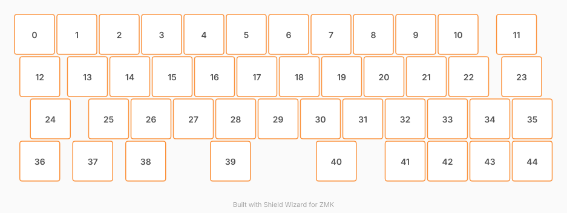

# ZMK Configuration for fourty

*Generated by Shield Wizard for ZMK*



Download compiled firmware from the Actions tab. <https://zmk.dev/docs/user-setup#installing-the-firmware>

Edit your keymap <https://zmk.dev/docs/keymaps>.
User keymap is located at [`config/fourty.keymap`](config/fourty.keymap).

-----

<details>
<summary>
Shield Wizard Debug Information
</summary>

In case of broken configuration, here is the Shield Wizard internal data used to generate this configuration:

Commit: ab99418c376887d043556e4a1af5a8d1c78d686c

```json
{"name":"fourty","shield":"fourty","dongle":false,"modules":[],"layout":[{"id":"01M1N9PZSH4M4BY8ZB3TE2PM8R","part":0,"row":0,"col":0,"w":1,"h":1,"x":0,"y":0,"r":0,"rx":0,"ry":0},{"id":"01M1N9PZSGCPSGAPQ2YZ227FZX","part":0,"row":0,"col":1,"w":1,"h":1,"x":1,"y":0,"r":0,"rx":0,"ry":0},{"id":"01M1N9PZSG2PMR8RGB798G5MR7","part":0,"row":0,"col":2,"w":1,"h":1,"x":2,"y":0,"r":0,"rx":0,"ry":0},{"id":"01M1N9PZSH2CF92J95YAKBZE1Z","part":0,"row":0,"col":3,"w":1,"h":1,"x":3,"y":0,"r":0,"rx":0,"ry":0},{"id":"01M1N9PZSH5S0FKNQ81PDPPT5V","part":0,"row":0,"col":4,"w":1,"h":1,"x":4,"y":0,"r":0,"rx":0,"ry":0},{"id":"01M1N9PZSGBP0NWNC099BD2F2X","part":0,"row":0,"col":5,"w":1,"h":1,"x":5,"y":0,"r":0,"rx":0,"ry":0},{"id":"01M1N9PZSHSVMT2Q9NEMNZ1XHW","part":0,"row":0,"col":6,"w":1,"h":1,"x":6,"y":0,"r":0,"rx":0,"ry":0},{"id":"01M1N9PZSF3D9VGREKYKYTT6RA","part":0,"row":0,"col":7,"w":1,"h":1,"x":7,"y":0,"r":0,"rx":0,"ry":0},{"id":"01M1N9PZSHSMPRKMDMZSBK1FXX","part":0,"row":0,"col":8,"w":1,"h":1,"x":8,"y":0,"r":0,"rx":0,"ry":0},{"id":"01M1N9PZSGXN13K1TANN5GDFF8","part":0,"row":0,"col":9,"w":1,"h":1,"x":9,"y":0,"r":0,"rx":0,"ry":0},{"id":"01M1N9PZSGE371FMP3RY1VZKTR","part":0,"row":0,"col":10,"w":1,"h":1,"x":10,"y":0,"r":0,"rx":0,"ry":0},{"id":"01M1N9PZSG69JWTXMB8MZEQS3S","part":0,"row":0,"col":11,"w":1,"h":1,"x":11.38,"y":0,"r":0,"rx":0,"ry":0},{"id":"01M1N9PZSFSAMGWBNEFFBAE8K1","part":0,"row":1,"col":0,"w":1,"h":1,"x":0.125,"y":1,"r":0,"rx":0,"ry":0},{"id":"01M1N9PZSGKAV4DWS6JSKT5D4Z","part":0,"row":1,"col":1,"w":1,"h":1,"x":1.25,"y":1,"r":0,"rx":0,"ry":0},{"id":"01M1N9PZSGAJHSBYCY1MRV16P0","part":0,"row":1,"col":2,"w":1,"h":1,"x":2.25,"y":1,"r":0,"rx":0,"ry":0},{"id":"01M1N9PZSGPK9PRW0RMG92FBWT","part":0,"row":1,"col":3,"w":1,"h":1,"x":3.25,"y":1,"r":0,"rx":0,"ry":0},{"id":"01M1N9PZSF6KBBD2F24D0BZKM6","part":0,"row":1,"col":4,"w":1,"h":1,"x":4.25,"y":1,"r":0,"rx":0,"ry":0},{"id":"01M1N9PZSHN6JZ97T2VA8WVSQ3","part":0,"row":1,"col":5,"w":1,"h":1,"x":5.25,"y":1,"r":0,"rx":0,"ry":0},{"id":"01M1N9PZSFJH6C1VWXZ0SHAWFQ","part":0,"row":1,"col":6,"w":1,"h":1,"x":6.25,"y":1,"r":0,"rx":0,"ry":0},{"id":"01M1N9PZSFZJYCQPT6Q3Y2PZ02","part":0,"row":1,"col":7,"w":1,"h":1,"x":7.25,"y":1,"r":0,"rx":0,"ry":0},{"id":"01M1N9PZSGD4SZBAQ9HGJ55SKA","part":0,"row":1,"col":8,"w":1,"h":1,"x":8.25,"y":1,"r":0,"rx":0,"ry":0},{"id":"01M1N9PZSHJ5NE7AW4SWW938N7","part":0,"row":1,"col":9,"w":1,"h":1,"x":9.25,"y":1,"r":0,"rx":0,"ry":0},{"id":"01M1N9PZSGTGTAG7SPJXPF1BFR","part":0,"row":1,"col":10,"w":1,"h":1,"x":10.25,"y":1,"r":0,"rx":0,"ry":0},{"id":"01M1N9PZSF30QXTZN7PJP5WJSH","part":0,"row":1,"col":11,"w":1,"h":1,"x":11.5,"y":1,"r":0,"rx":0,"ry":0},{"id":"01M1N9PZSF6WZ5SWEX0YNJ4A1D","part":0,"row":2,"col":0,"w":1,"h":1,"x":0.375,"y":2,"r":0,"rx":0,"ry":0},{"id":"01M1N9PZSHXQ3ZD8JS916ZEA9J","part":0,"row":2,"col":1,"w":1,"h":1,"x":1.75,"y":2,"r":0,"rx":0,"ry":0},{"id":"01M1N9PZSGFGZPAKM53W5DB1M9","part":0,"row":2,"col":2,"w":1,"h":1,"x":2.75,"y":2,"r":0,"rx":0,"ry":0},{"id":"01M1N9PZSHWP357S3D38P4BZW8","part":0,"row":2,"col":3,"w":1,"h":1,"x":3.75,"y":2,"r":0,"rx":0,"ry":0},{"id":"01M1N9PZSGX33X7GY98YVZFKSN","part":0,"row":2,"col":4,"w":1,"h":1,"x":4.75,"y":2,"r":0,"rx":0,"ry":0},{"id":"01M1N9PZSGWB3VVFR6YX43GQTT","part":0,"row":2,"col":5,"w":1,"h":1,"x":5.75,"y":2,"r":0,"rx":0,"ry":0},{"id":"01M1N9PZSGGBCGDWZBYYH622DF","part":0,"row":2,"col":6,"w":1,"h":1,"x":6.75,"y":2,"r":0,"rx":0,"ry":0},{"id":"01M1N9PZSHD8E2C20THEKKYBBP","part":0,"row":2,"col":7,"w":1,"h":1,"x":7.75,"y":2,"r":0,"rx":0,"ry":0},{"id":"01M1N9PZSH7JPKNH8XRNCF39Z1","part":0,"row":2,"col":8,"w":1,"h":1,"x":8.75,"y":2,"r":0,"rx":0,"ry":0},{"id":"01M1N9PZSHRGWY8MCXGTNBMPA6","part":0,"row":2,"col":9,"w":1,"h":1,"x":9.75,"y":2,"r":0,"rx":0,"ry":0},{"id":"01M1N9PZSGXEENGJ30BTZ258BA","part":0,"row":2,"col":10,"w":1,"h":1,"x":10.75,"y":2,"r":0,"rx":0,"ry":0},{"id":"01M1N9PZSG326WEV9BF90F2WXB","part":0,"row":2,"col":11,"w":1,"h":1,"x":11.75,"y":2,"r":0,"rx":0,"ry":0},{"id":"01M1N9PZSFBWV54BEYRGFTGJG1","part":0,"row":3,"col":0,"w":1,"h":1,"x":0.125,"y":3,"r":0,"rx":0,"ry":0},{"id":"01M1N9PZSFWF59X0VE669MNXC0","part":0,"row":3,"col":1,"w":1,"h":1,"x":1.375,"y":3,"r":0,"rx":0,"ry":0},{"id":"01M1N9PZSH8C3TG94K577ARP01","part":0,"row":3,"col":2,"w":1,"h":1,"x":2.625,"y":3,"r":0,"rx":0,"ry":0},{"id":"01M1N9PZSFEKYWWXH5X9JZBSP4","part":0,"row":3,"col":4,"w":1,"h":1,"x":4.625,"y":3,"r":0,"rx":0,"ry":0},{"id":"01M1N9PZSFQ6159MW2BE6HHG9D","part":0,"row":3,"col":7,"w":1,"h":1,"x":7.125,"y":3,"r":0,"rx":0,"ry":0},{"id":"01M1N9PZSG5PN5ZKHE4DSZ16XG","part":0,"row":3,"col":8,"w":1,"h":1,"x":8.75,"y":3,"r":0,"rx":0,"ry":0},{"id":"01M1N9PZSHVKDCXQ841NH9VMB3","part":0,"row":3,"col":9,"w":1,"h":1,"x":9.75,"y":3,"r":0,"rx":0,"ry":0},{"id":"01M1N9PZSG3DF6DQ907G413TB7","part":0,"row":3,"col":10,"w":1,"h":1,"x":10.75,"y":3,"r":0,"rx":0,"ry":0},{"id":"01M1N9PZSHGYY80PTRB76VDV7W","part":0,"row":3,"col":11,"w":1,"h":1,"x":11.75,"y":3,"r":0,"rx":0,"ry":0}],"parts":[{"name":"fourty","controller":"nice_nano_v2","pins":{"d0":{"usage":"kscan","kscan":"01M1N9SRGT662YW0C23WX1J8A3","role":"input"},"d1":{"usage":"kscan","kscan":"01M1N9SRGT662YW0C23WX1J8A3","role":"input"},"d2":{"usage":"kscan","kscan":"01M1N9SRGT662YW0C23WX1J8A3","role":"input"},"d3":{"usage":"kscan","kscan":"01M1N9SRGT662YW0C23WX1J8A3","role":"input"},"d4":{"usage":"kscan","kscan":"01M1N9SRGT662YW0C23WX1J8A3","role":"input"},"d5":{"usage":"kscan","kscan":"01M1N9SRGT662YW0C23WX1J8A3","role":"input"},"d6":{"usage":"kscan","kscan":"01M1N9SRGT662YW0C23WX1J8A3","role":"input"},"d7":{"usage":"kscan","kscan":"01M1N9SRGT662YW0C23WX1J8A3","role":"input"},"d8":{"usage":"kscan","kscan":"01M1N9SRGT662YW0C23WX1J8A3","role":"input"},"d9":{"usage":"kscan","kscan":"01M1N9SRGT662YW0C23WX1J8A3","role":"input"},"d10":{"usage":"kscan","kscan":"01M1N9SRGT662YW0C23WX1J8A3","role":"input"},"d14":{"usage":"kscan","kscan":"01M1N9SRGT662YW0C23WX1J8A3","role":"input"},"d15":{"usage":"kscan","kscan":"01M1N9SRGT662YW0C23WX1J8A3","role":"output"},"d16":{"usage":"kscan","kscan":"01M1N9SRGT662YW0C23WX1J8A3","role":"output"},"d19":{"usage":"kscan","kscan":"01M1N9SRGT662YW0C23WX1J8A3","role":"output"},"d18":{"usage":"kscan","kscan":"01M1N9SRGT662YW0C23WX1J8A3","role":"output"}},"kscans":[{"kind":"matrix","id":"01M1N9SRGT662YW0C23WX1J8A3","diodes":true}],"keys":{"01M1N9PZSH4M4BY8ZB3TE2PM8R":{"input":"d0","output":"d15"},"01M1N9PZSFSAMGWBNEFFBAE8K1":{"input":"d0","output":"d16"},"01M1N9PZSF6WZ5SWEX0YNJ4A1D":{"input":"d0","output":"d19"},"01M1N9PZSFBWV54BEYRGFTGJG1":{"input":"d0","output":"d18"},"01M1N9PZSGCPSGAPQ2YZ227FZX":{"input":"d1","output":"d15"},"01M1N9PZSGKAV4DWS6JSKT5D4Z":{"input":"d1","output":"d16"},"01M1N9PZSHXQ3ZD8JS916ZEA9J":{"input":"d1","output":"d19"},"01M1N9PZSFWF59X0VE669MNXC0":{"input":"d1","output":"d18"},"01M1N9PZSG2PMR8RGB798G5MR7":{"input":"d2","output":"d15"},"01M1N9PZSH2CF92J95YAKBZE1Z":{"input":"d3","output":"d15"},"01M1N9PZSGAJHSBYCY1MRV16P0":{"input":"d2","output":"d16"},"01M1N9PZSGPK9PRW0RMG92FBWT":{"input":"d3","output":"d16"},"01M1N9PZSGFGZPAKM53W5DB1M9":{"input":"d2","output":"d19"},"01M1N9PZSH8C3TG94K577ARP01":{"input":"d2","output":"d18"},"01M1N9PZSHWP357S3D38P4BZW8":{"input":"d3","output":"d19"},"01M1N9PZSFEKYWWXH5X9JZBSP4":{"input":"d3","output":"d18"},"01M1N9PZSH5S0FKNQ81PDPPT5V":{"input":"d4","output":"d15"},"01M1N9PZSF6KBBD2F24D0BZKM6":{"input":"d4","output":"d16"},"01M1N9PZSGX33X7GY98YVZFKSN":{"input":"d4","output":"d19"},"01M1N9PZSGBP0NWNC099BD2F2X":{"input":"d5","output":"d15"},"01M1N9PZSHN6JZ97T2VA8WVSQ3":{"input":"d5","output":"d16"},"01M1N9PZSGWB3VVFR6YX43GQTT":{"input":"d5","output":"d19"},"01M1N9PZSHSVMT2Q9NEMNZ1XHW":{"input":"d6","output":"d15"},"01M1N9PZSFJH6C1VWXZ0SHAWFQ":{"input":"d6","output":"d16"},"01M1N9PZSGGBCGDWZBYYH622DF":{"input":"d6","output":"d19"},"01M1N9PZSFQ6159MW2BE6HHG9D":{"input":"d6","output":"d18"},"01M1N9PZSF3D9VGREKYKYTT6RA":{"input":"d7","output":"d15"},"01M1N9PZSFZJYCQPT6Q3Y2PZ02":{"input":"d7","output":"d16"},"01M1N9PZSHD8E2C20THEKKYBBP":{"input":"d7","output":"d19"},"01M1N9PZSHSMPRKMDMZSBK1FXX":{"input":"d8","output":"d15"},"01M1N9PZSGD4SZBAQ9HGJ55SKA":{"input":"d8","output":"d16"},"01M1N9PZSH7JPKNH8XRNCF39Z1":{"input":"d8","output":"d19"},"01M1N9PZSG5PN5ZKHE4DSZ16XG":{"input":"d8","output":"d18"},"01M1N9PZSGXN13K1TANN5GDFF8":{"input":"d9","output":"d15"},"01M1N9PZSHJ5NE7AW4SWW938N7":{"input":"d9","output":"d16"},"01M1N9PZSHRGWY8MCXGTNBMPA6":{"input":"d9","output":"d19"},"01M1N9PZSHVKDCXQ841NH9VMB3":{"input":"d9","output":"d18"},"01M1N9PZSGE371FMP3RY1VZKTR":{"input":"d10","output":"d15"},"01M1N9PZSGTGTAG7SPJXPF1BFR":{"input":"d10","output":"d16"},"01M1N9PZSGXEENGJ30BTZ258BA":{"input":"d10","output":"d19"},"01M1N9PZSG3DF6DQ907G413TB7":{"input":"d10","output":"d18"},"01M1N9PZSG69JWTXMB8MZEQS3S":{"input":"d14","output":"d15"},"01M1N9PZSF30QXTZN7PJP5WJSH":{"input":"d14","output":"d16"},"01M1N9PZSG326WEV9BF90F2WXB":{"input":"d14","output":"d19"},"01M1N9PZSHGYY80PTRB76VDV7W":{"input":"d14","output":"d18"}},"encoders":[],"buses":{}}]}
```

</details>
